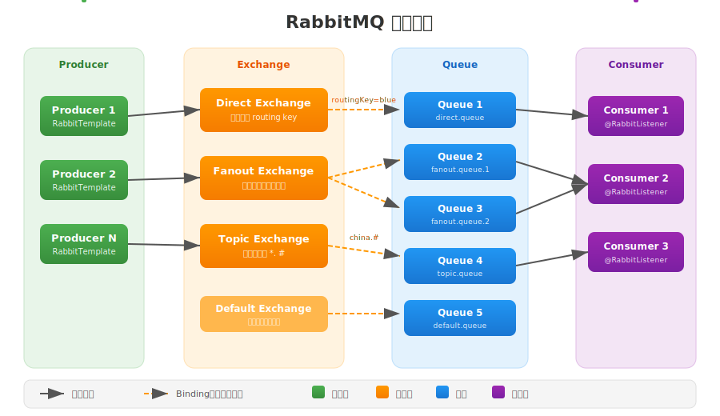

# RabbitMQ

Spring Boot 中提供`spring-boot-starter-amqp`包来处理`Spring Boot`和`RabbitMQ`的交互

## RabbitMQ基本架构



## 集成到SpringBoot

> [!NOTE]
>
> 开始之前请确认已经安装了`RabbitMQ`, 并启动了`RabbitMQ`服务

### 项目初始化

#### 引入Maven依赖

```xml
<dependency>
   <groupId>org.springframework.boot</groupId>
   <artifactId>spring-boot-starter-amqp</artifactId>
   <version>[last-version]</version>
</dependency>
```

> [!TIP]
> Maven中央仓库地址：[spring-boot-starter-amqp](https://central.sonatype.com/artifact/org.springframework.boot/spring-boot-starter-amqp/versions)

#### 配置连接信息

在 `application.yml` 中配置 RabbitMQ 连接信息：

```yaml
# application.yml
spring:
  rabbitmq:
    host: localhost                # RabbitMQ 服务器地址
    port: 5672                     # RabbitMQ 端口号，默认5672
    username: your_username        # 登录用户名
    password: your_password        # 登录密码
    virtual-host: "your_vhost"     # 虚拟主机名称，默认为"/"
```


### 声明基础设施

通过 `@Bean` 声明队列、交换机及绑定关系，Spring Boot 会在应用启动时自动在 Broker 上创建这些资源（如果不存在）。

#### 创建队列

在 `Spring Boot` 中可以通过注册 Bean 的方式创建队列。 有以下两种方式创建队列:


- **通过构造器创建**

```java
@Bean
public Queue directQueue() {
    return new Queue(
        "direct.queue",   // 队列名称
        true,             // 是否持久化
        false,            // 是否排他
        false             // 是否自动删除
    );
}
```

- **通过建造者模式创建**

```java
@Bean
public Queue builderQueue() {
    return QueueBuilder
            .durable("builder.queue")           // 队列名称 & 持久化
            .exclusive()                        // 排他队列（仅当前连接可见）
            .autoDelete()                       // 自动删除（无消费者自动删除）
            .withArgument("x-message-ttl", 60000) // 消息存活时间（毫秒）
            .withArgument("x-max-length", 1000)   // 最大消息数
            .withArgument("x-dead-letter-exchange", "dlx.exchange") // 死信交换机
            .withArgument("x-dead-letter-routing-key", "dlx.key")   // 死信路由键
            .build();
}
```

#### 创建交换机

在 `Spring Boot` 中可以通过注册 Bean 的方式创建交换机。RabbitMQ 支持多种交换机类型，常见的类型交换机如下：

| 交换机类型         | 说明                                                         | 代码示例 Bean 类型         |
|------------------|------------------------------------------------------------|---------------------------|
| **Direct**       | 直连交换机，按路由键精确匹配队列                             | `DirectExchange`          |
| **Fanout**       | 扇形交换机，消息广播到所有绑定队列                           | `FanoutExchange`          |
| **Topic**        | 主题交换机，支持通配符路由键                                 | `TopicExchange`           |

**Direct 交换机：**

```java
@Bean
public DirectExchange directExchange() {
    return new DirectExchange(
        "rabbitmq.direct",   // 交换机名称
        true,                // 是否持久化
        false                // 是否自动删除
    );
}
```

**Fanout 交换机：**
```java
@Bean
public FanoutExchange fanoutExchange() {
    return new FanoutExchange(
        "rabbitmq.fanout", 
        true, 
        false
    );
}
```

**Topic 交换机：**
```java
@Bean
public TopicExchange topicExchange() {
    return new TopicExchange(
        "rabbitmq.topic", 
        true, 
        false
    );
}
```

#### 绑定队列和交换机

创建好队列和交换机后，需要将它们进行绑定。绑定的作用是指定消息从交换机路由到哪个队列。可以通过注册 `Binding` 类的Bean 来实现队列和交换机的绑定。

常见交换机以其绑定方式如下：

| 交换机类型         | 绑定方式说明                                   |
|------------------|----------------------------------------------|
| **Direct 交换机** | 需要指定路由键（routingKey）                    |
| **Fanout 交换机** | 不需要指定路由键，所有绑定的队列都会收到消息      |
| **Topic 交换机**  | 需要指定支持通配符的路由键                       |

> [!TIP]
> 下面的示例，假设都已经注册了队列和交换机对应的Bean。

- **Fanout 交换机的绑定**

```java
@Bean
public Binding bindingFanout(Queue fanoutQueue, FanoutExchange fanoutExchange) {
    return BindingBuilder.bind(fanoutQueue)
                         .to(fanoutExchange);
}
```

- **Direct 交换机的绑定**

```java
@Bean
public Binding bindingDirect(Queue directQueue, DirectExchange directExchange) {
    return BindingBuilder.bind(directQueue)
                         .to(directExchange)
                         .with("blue"); // 指定路由键
}
```

- **Topic 交换机的绑定**

```java
@Bean
public Binding bindingTopic(Queue topicQueue, TopicExchange topicExchange) {
    return BindingBuilder.bind(topicQueue)
                         .to(topicExchange)
                         .with("china.#"); // 支持通配符
}
```

### 发送消息到交换机

通过 `RabbitTemplate` 将消息发布到交换机，由交换机根据绑定规则路由到队列。

Spring AMQP 提供了 `RabbitTemplate` 作为消息发送的核心组件。你可以通过它将消息发送到指定的交换机和队列，支持多种消息体类型（字符串、对象、Map等），并可灵活设置路由键、消息属性等。

**发送消息的基本方法**

- **convertAndSend(exchange: String, routingKey: String, message: Object)**
  发送消息到指定交换机和路由键，`message`参数可以是字符串、对象、Map等类型，方法会自动将消息体序列化为字节流。

- **send(exchange: String, routingKey: String, message: Message)**
  发送自定义 `Message` 类型对象，可以手动设置消息属性（如内容类型、消息头等），适用于需要精细控制消息元数据的场景。

```java
@Autowired
private RabbitTemplate rabbitTemplate;

public void sendMessages() {
    // Direct Exchange 发送字符串消息
    rabbitTemplate.convertAndSend("rabbitmq.direct", "blue", "Hello Direct Exchange!");

    // Direct Exchange 发送对象消息（自动序列化为JSON）
    Order order = new Order("1001", "手机", 1);
    rabbitTemplate.convertAndSend("rabbitmq.direct", "order", order);

    // Fanout Exchange 发送消息（不需要路由键）
    rabbitTemplate.convertAndSend("rabbitmq.fanout", "", "Hello Fanout Exchange!");

    // Topic Exchange 发送消息（路由键支持通配符）
    rabbitTemplate.convertAndSend("rabbitmq.topic", "china.#", "中国所有新闻");
    rabbitTemplate.convertAndSend("rabbitmq.topic", "*.news", "任意国家新闻");
    rabbitTemplate.convertAndSend("rabbitmq.topic", "china.*.sports", "中国各地体育新闻");

    // 发送带属性的消息
    MessageProperties props = new MessageProperties();
    props.setContentType(MessageProperties.CONTENT_TYPE_TEXT_PLAIN);
    props.setHeader("myHeader", "headerValue");
    Message message = new Message("消息带属性".getBytes(StandardCharsets.UTF_8), props);

    rabbitTemplate.send("rabbitmq.direct", "blue", message);
}
```

#### 自定义序列化器

默认情况下，`RabbitTemplate` 会使用 Jackson 将对象序列化为 JSON 格式发送。你可以通过注册 `MessageConverter` 实现类为`Bean`自定义序列化方式。

```java
@Bean
public MessageConverter messageConverter() {
    return new Jackson2JsonMessageConverter();
}
```

> [!NOTE]
> 使用`convertAndSend`方法发送的消息才会使用序列化器序列化

#### 延迟消息

**延迟消息**是指交换机中的消息在指定时间过后才投递消息到队列中. 通过以下步骤使用延迟消息这个特性:

> [!TIP]
> 在**RabbitMq**中并没有原生支持延迟消息功能，需要额外安装 [延迟消息插件](https://github.com/rabbitmq/rabbitmq-delayed-message-exchange)提供支持

> [!NOTE]
> 只有**延迟交换机**才能够处理带有延迟标记的消息

1. 创建延迟交换机

- **通过构造器创建**

```java
@Bean
public CustomExchange delayedExchange() {
    Map<String, Object> args = new HashMap<>();
    args.put("x-delayed-type", "direct"); // 指定实际交换机类型
    return new CustomExchange(
        "rabbitmq.delayed",                // 交换机名称
        "x-delayed-message",               // 交换机类型，启用延迟功能
        true,                              // 是否持久化
        false,                             // 是否自动删除
        args                               // 交换机参数
    );
}
```

- **通过建造者模式创建**

```java
@Bean
public Exchange delayedExchange() {
    return ExchangeBuilder.directExchange("delayed_exchange")
                          .delayed()
                          .durable(true)
                          .build();
}
```

2. 发送延迟消息

```java
rabbitTemplate.convertAndSend("rabbitmq.delayed", "delayed.key", "延迟消息", message -> {
    message.getMessageProperties().setDelay(5000); // 延迟5秒
    return message;
});
```

### 消费队列中的消息

通过 `@RabbitListener` 监听队列，接收并处理消息。

在 Spring Boot 中，RabbitMQ 消费者的实现方式主要有以下几种

- **`@RabbitListener` 注解**

```java
@Component
public class RabbitConsumer {

    // 监听队列名为 direct.queue 队列
    @RabbitListener(queues = "direct.queue")
    public void receiveDirectQueue(String message) {
        log.info("收到 direct.queue 消息: {}", message);
    }

    // 监听队列名为 fanout.queue 队列
    @RabbitListener(queues = "fanout.queue")
    public void receiveFanoutQueue(String message) {
        log.info("收到 fanout.queue 消息: {}", message);
    }
}
```

- **`@RabbitHandler` + `@RabbitListener`注解**

适用于同一个队列需要根据消息类型分发到不同方法处理的场景。

```java
@Component
@RabbitListener(queues = "multi.queue")
public class MultiTypeConsumer {

    @RabbitHandler
    public void receiveString(String message) {
        log.info("multi.queue 收到字符串消息: {}", message);
    }

    @RabbitHandler
    public void receiveOrder(Order order) {
        log.info("multi.queue 收到订单消息: {}", order);
    }
}
```

`@RabbitListener`注解属性参考表:

| 参数名称                | 参数作用                                                                                                   |
|------------------------|------------------------------------------------------------------------------------------------------------|
| queues                 | 指定要监听的队列名称（支持多个队列）                                                                       |
| queueNames             | 与 queues 类似，指定队列名称（推荐使用 queues）                                                            |
| bindings               | 通过 @QueueBinding 注解方式绑定队列和交换机                                                                |
| containerFactory       | 指定使用的消息监听容器工厂（默认 simpleRabbitListenerContainerFactory）                                    |
| concurrency            | 设置并发消费者数量，提升消费能力                                                                           |
| acknowledgeMode        | 消息消费后的确认机制（auto：自动确认，manual：手动确认，none：不确认）                                     |
| autoStartup            | 是否自动启动监听器（默认 true）                                                                            |
| exclusive              | 是否独占队列（仅当前消费者可消费）                                                                         |
| id                     | 指定监听器的唯一标识符                                                                                    |
| errorHandler           | 指定异常处理器 Bean 名称                                                                                   |
| messageConverter       | 指定消息转换器 Bean 名称                                                                                   |
| replyTimeout           | 指定回复超时时间（用于 RPC 场景）                                                                          |
| returnExceptions       | 是否将异常返回给发送方（用于 RPC 场景）                                                                    |
| priority               | 设置消费者优先级                                                                                          |
| retryEnabled           | 是否开启消费失败自动重试                                                                                   |
| prefetch               | 每次预取消息数量，控制每个消费者一次拉取的消息数，避免消息堆积                                             |
| batch                  | 是否批量消费消息（默认 false）                                                                            |
| consumerTagPrefix      | 设置消费者标签前缀                                                                                        |
| arguments              | 额外参数（Map 类型），用于声明队列、交换机等时传递自定义参数                                               |
| deBatchingEnabled      | 是否开启批量消息拆分（默认 true）                                                                         |
| missingQueuesFatal     | 队列不存在时是否抛出异常（默认 true）                                                                     |
| noLocal                | 是否只消费本地消息（默认 false）                                                                          |
| consumerArguments      | 消费者参数（Map 类型），用于设置消费者属性                                                                 |
| ackMode                | 消息确认模式（auto/manual/none，等同于 acknowledgeMode）                                                  |

**使用示例：**

```java
@RabbitListener(
    queues = {"direct.queue", "fanout.queue"},
    concurrency = "3",
    acknowledgeMode = "manual",
    autoStartup = "true",
    id = "myListener",
    containerFactory = "myRabbitListenerContainerFactory",
    errorHandler = "myErrorHandler",
    messageConverter = "myMessageConverter",
    prefetch = "5"
)
public void handleMessage(String message) {
    log.info("收到消息: {}", message);
    // 手动确认逻辑...
}
```

## 通配符规则

主题交换机支持根据通配符路由,  通配符规则如下:

- `*` (星号)：匹配**一个**单词
- `#` (井号)：匹配**零个或多个**单词

**示例：**

- `china.#` 可以匹配：`china.news`、`china.sports`、`china.tech.ai` 等
- `*.news` 可以匹配：`china.news`、`usa.news`、`uk.news` 等
- `china.*.sports` 可以匹配：`china.beijing.sports`、`china.shanghai.sports` 等

## 消息可靠性

`Spring AMQP`提供了一些配置选项来提高消息可靠性

### 生产者消息可靠性

```yaml
spring:
  rabbitmq:
  publisher-confirm-type: correlated          # 开启发布确认（异步回调）
  publisher-returns: true                     # 开启消息返回机制
  template:
      mandatory: true
      retry:
        enabled: true                           # 开启重试
        max-attempts: 3                         # 最大重试次数
        initial-interval: 1000                  # 初始重试间隔(ms)
        multiplier: 2.0                         # 重试间隔倍数
        max-interval: 10000                     # 最大重试间隔(ms)
```

#### publisher-returns

当属性值设置为`true`时, 如果消息投递到交换机成功, 但是没有匹配到任何队列, 则会触发**消息返回回调**。

#### publisher-confirm-type

当前属性设置为非`none`值时, 可为消息配置`confirm`回调, `confirm`回调**在消息成功到达 RabbitMQ Broker 后才会触发(无论是 ack 还是 nack)**

- **ack:** 消息成功交由指定的交换机并持久化(如果开启了持久化)
- **nack:** 消息被拒绝

可选值参考表:

| 可选值         | 说明                                                         |
|---------------|--------------------------------------------------------------|
| **none**      | 不启用发布确认机制，消息发送后不进行确认回调。                |
| **correlated**| 启用异步发布确认，发送消息后通过回调接口异步接收确认结果。    |
| **simple**    | 启用同步发布确认，发送消息后会阻塞等待RabbitMQ返回确认结果。  |

> [!NOTE]
>
> 以下情况消息到达队列后会发生nack:
> + 消息指定的交换机不存在
> + 交换机配置错误或权限不足
> + Broker 内部错误(如磁盘满、内存溢出)
> + 消息被强制拒绝

##### 单条消息配置回调

仅对当前发送的消息生效

```java
public void addCouponToQueue(Long voucherId) {
    VoucherOrder voucherOrder = createOrder(voucherId);
    String orderJson = JSONUtil.toJsonStr(voucherOrder);

    // 针对单条消息设置回调
    CorrelationData correlationData = new CorrelationData(UUID.fastUUID().toString(true));
    correlationData.getFuture().addCallback(
            this::handleAddVoucherToQueueSuccess, 
            this::handleAddVoucherToQueueFailure
    );
    rabbitTemplate.convertAndSend(EXCHANGE_NAME, ROUTE_KEY, orderJson, correlationData);
}

private VoucherOrder createOrder(Long voucherId) {
    return VoucherOrder.builder()
                       .userId(UserHolder.getUser().getId())
                       .voucherId(voucherId)
                       .build();
}

// 消息成功无法到达RabbitMQ Broker时触发的回调
private void handleAddVoucherToQueueFailure(Throwable e) {
    log.info("消息投递失败");
}

// 消息成功到达RabbitMQ Broker时触发的回调
private void handleAddVoucherToQueueSuccess(CorrelationData.Confirm ok) {
    log.info("消息投递成功");
}
```

##### 全局消息回调

对每一条发送的消息都生效

```java
@Configuration
public class RabbitConfig {

    @Bean
    public RabbitTemplate rabbitTemplate(ConnectionFactory connectionFactory) {
        RabbitTemplate rabbitTemplate = new RabbitTemplate(connectionFactory);

        // 消息发送到交换机确认回调
        rabbitTemplate.setConfirmCallback(new RabbitTemplate.ConfirmCallback() {
            @Override
            public void confirm(CorrelationData correlationData, boolean ack, String cause) {
                if (ack) {
                    System.out.println("消息成功到达交换机，correlationData: " + correlationData);
                } else {
                    System.out.println("消息未到达交换机，原因: " + cause);
                }
            }
        });

        // 消息尝试从交换机路由到队列失败时触发该回调
        rabbitTemplate.setReturnCallback(new RabbitTemplate.ReturnCallback() {
            @Override
            public void returnedMessage(Message message, int replyCode, String replyText,
                                       String exchange, String routingKey) {
                System.out.println("消息未路由到队列，exchange: " + exchange + ", routingKey: " + routingKey);
            }
        });

        return rabbitTemplate;
    }
}
```

### 消费者消息可靠性

```yaml
spring:
  rabbitmq:
    listener:
      simple:
       # 消息没有被成功消息(抛异常或nack)时, 使用默认的拒绝策略重入队
       # 仅在没有设置retry时生效, 默认值为true(当抛出异常时会无限重试)
        default-requeue-rejected: false 		
        acknowledge-mode: auto                  # 消息确认模式（auto/manual/none）
        prefetch: 1								# 每次预取消息数量
        # Spring AMQP 提供的生产者重试机制
        retry:
          enabled: true                         # 开启重试
          max-attempts: 3                       # 最大重试次数
          initial-interval: 1000                # 初始重试间隔(ms)
          multiplier: 2.0                       # 重试间隔倍数
          max-interval: 10000                   # 最大重试间隔(ms)
```
#### acknowledge-mode

`acknowledge-mode` 用于控制消息消费后的确认机制.

可选值参考表:

| 参数值      | 说明                                                         | 适用场景           |
|-------------|--------------------------------------------------------------|--------------------|
| **auto**    | 自动确认。消息被监听方法成功消费后自动确认，无需手动处理。    | 默认推荐，简单场景 |
| **manual**  | 手动确认。需要在代码中显式调用 `channel.basicAck` 或 `channel.basicNack` 方法进行消息确认或拒绝。 | 业务复杂、需精细控制消息处理结果时 |
| **none**    | 不确认。RabbitMQ 不会等待任何确认，消息一旦投递即认为已消费。 | 性能优先但有丢失风险 |

> [!NOTE]
> 在SpringBoot 之中，默认使用 `auto` 模式，当监听方法执行完成时，消息会被自动确认；如果监听方法抛出异常，消息会被拒绝并根据配置进行重试或丢弃。

#### retry

默认值为`false`, 设置为`true`时, 消费者处理消息出现异常时, 不断的进行重试, 直到重试次数达到`max-attempts`. 到达最大重试次数后创建一个名为`error.excahnge`的交换机, 并通过路由健`error.msg`绑定到队列`error.queue`. 然后将错误信息投递到`error.exchange`交换机, 路由到`error.queue`

#### default-requeue-rejected

默认值为`true`, 当消费者处理消息出现异常时, 是否重新入队. 如果异常一直存在, 在其值设置为`true`时, 会无限重试造成cpu空转

> [!note]
>
> 仅在retry的enable值为`false`时生效
