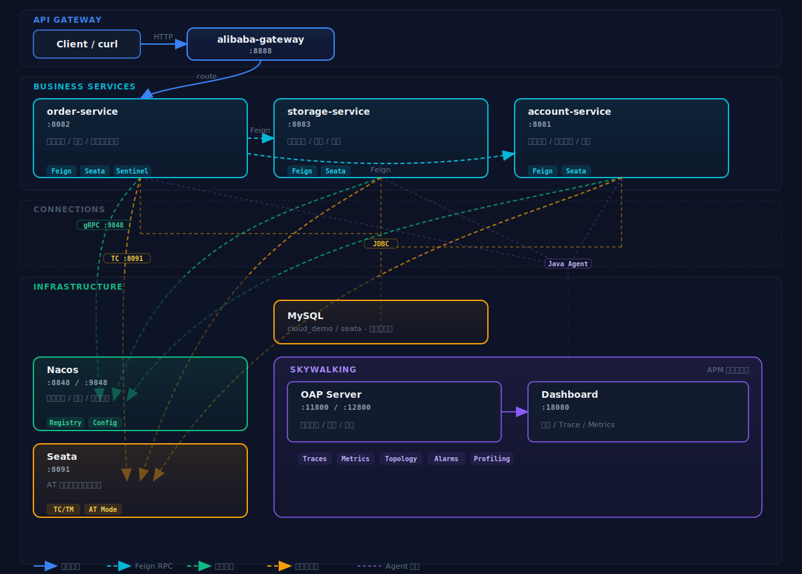

# spring-cloud-alibaba-demo

## 模块结构

```text
spring-cloud-alibaba-demo/
├── alibaba-common/      # 公共模型与异常封装
├── alibaba-gateway/     # 网关入口与路由转发
├── cloud-service/       # 业务服务（order/storage/account）
├── docs/
│   ├── sql/             # 初始化 SQL
│   ├── docker/          # 统一 Docker 编排与 .env
│   └── scripts/
│       └── skywalking-closure.sh  # 一键闭环启动脚本
```

## 总体架构图



## 组件介绍

- **Nacos**：服务注册、服务发现、配置管理、配置热更新
- **Sentinel**：流量控制、熔断降级、热点参数限流、系统自适应保护
- **Seata**：分布式事务协调、AT 模式全局事务管理、全局锁控制
- **SkyWalking**：链路追踪、性能指标监控、服务拓扑分析、日志采集
- **Gateway**：请求路由、路径重写、统一鉴权、过滤器链、异常处理
- **MySQL**：数据持久化、事务存储

## 控制台访问地址

- `Nacos Console`：`http://127.0.0.1:18848/`（默认账号/密码 nacos/nacos）
- `Sentinel Dashboard`：`http://127.0.0.1:8080`（默认账号/密码 sentinel/sentinel）
- `SkyWalking UI`：`http://127.0.0.1:18080`（默认无需鉴权）

## 控制台登录说明

- 当前 `docs/docker/.env` 默认配置为 `NACOS_AUTH_ENABLE=false`，本地 demo 可直接访问 Nacos Console。
- 如果你改成 `NACOS_AUTH_ENABLE=true`，Nacos 默认账号密码是 `nacos/nacos`（首次登录建议修改）。
- Sentinel Dashboard 默认账号密码是 `sentinel/sentinel`。

## 手动启动顺序

1. 启动基础组件（MySQL / Nacos / Seata / Sentinel / SkyWalking）：

```bash
cd spring-cloud-alibaba-demo/docs/docker
docker compose --env-file .env -f compose.yml up -d
```

2. 回到项目根目录，启动业务服务：

```bash
mvn -pl spring-cloud-alibaba-demo/cloud-service/account-service spring-boot:run
mvn -pl spring-cloud-alibaba-demo/cloud-service/storage-service spring-boot:run
mvn -pl spring-cloud-alibaba-demo/cloud-service/order-service spring-boot:run
mvn -pl spring-cloud-alibaba-demo/alibaba-gateway spring-boot:run
```

## Gateway

### 请求路由

#### 配置

网关路由在 `application.yml` 中配置：

```yaml
spring:
  cloud:
    gateway:
      routes:
        - id: account-route
          uri: lb://account-service
          predicates:
            - Path=/account/**
          filters:
            - StripPrefix=1
        - id: order-route
          uri: lb://order-service
          predicates:
            - Path=/order/**
          filters:
            - StripPrefix=1
        - id: storage-route
          uri: lb://storage-service
          predicates:
            - Path=/storage/**
          filters:
            - StripPrefix=1
```

配置说明：
- `id`：路由唯一标识
- `uri`：目标服务地址，`lb://` 表示使用负载均衡
- `predicates`：路由匹配规则，`Path=/account/**` 表示以 `/account` 开头的请求
- `filters`：过滤器链，`StripPrefix=1` 表示去掉请求路径的第一段（如 `/account/api` -> `/api`）

#### 验证

尝试发送以下任意请求，请求由网关统一转发到对应的服务之中.

```bash
curl -sS "http://127.0.0.1:8888/account/api/account/health"
curl -sS "http://127.0.0.1:8888/storage/api/storage/health"
curl -sS "http://127.0.0.1:8888/order/api/order/health"
```

```bash
curl -sS "http://127.0.0.1:8888/account/api/account/list"
curl -sS "http://127.0.0.1:8888/storage/api/storage/list"
curl -sS "http://127.0.0.1:8888/order/api/order/list"
```

```bash
curl -sS -X POST "http://127.0.0.1:8888/order/api/order/create" \
  -H "Content-Type: application/json" \
  -d '{"userId":"u1001","commodityCode":"C1001","count":2,"money":100.00}'
```

---

### 网关异常处理

#### 配置

`alibaba-gateway` 配置了 `GatewayExceptionHandler` 全局异常处理器，统一处理网关层面的异常。

```java
@Slf4j
@Order(-1)
@Component
public class GatewayExceptionHandler implements ErrorWebExceptionHandler {

    @Override
    public Mono<Void> handle(ServerWebExchange exchange, Throwable ex) {
        HttpStatus status = resolveStatus(ex);
        String message = resolveMessage(ex, status);
        exchange.getResponse().setStatusCode(status);
        // 返回统一格式的 JSON 响应
    }
}
```

处理规则：

| 触发场景 | 状态码 | message 来源 |
|---------|--------|-------------|
| 路由失败（服务不可用） | 500 | "网关服务异常" |
| 路径不存在（404） | 404 | "Not Found" |
| 网关内部异常 | 500 | "网关服务异常" |

#### 验证

**场景 1：路由失败（服务不可用）**

前置条件：order-service 未启动

```bash
curl -sS "http://127.0.0.1:8888/order/api/order/list"
```

预期返回：
```json
{"code":500,"message":"网关服务异常"}
```

**场景 2：路径不存在（404）**

```bash
curl -sS "http://127.0.0.1:8888/not-exist-path"
```

预期返回：
```json
{"code":404,"message":"Not Found"}
```

---

### 全局过滤器

#### 配置

`alibaba-gateway` 配置了两个全局过滤器（GlobalFilter），位于 `filter/global/` 目录下，作用于所有路由。

**GatewayRequestLogFilter**

```java
@Slf4j
@Component
public class GatewayRequestLogFilter implements GlobalFilter {

    @Override
    public Mono<Void> filter(ServerWebExchange exchange, GatewayFilterChain chain) {
        log.info("Request: {} {}", request.getMethod(), request.getPath());
        return chain.filter(exchange)
                    .then(Mono.fromRunnable(() -> {
                        log.info("Response: {} - Status: {}", ...);
                    }));
    }
}
```

位置：`com.example.gateway.filter.global.GatewayRequestLogFilter`

**GatewayTimingFilter**

```java
@Slf4j
@Component
public class GatewayTimingFilter implements GlobalFilter {

    @Override
    public Mono<Void> filter(ServerWebExchange exchange, GatewayFilterChain chain) {
        exchange.getAttributes().put(START_TIME_ATTR, System.nanoTime());
        return chain.filter(exchange)
                    .then(Mono.fromRunnable(() -> {
                        // 计算耗时并记录日志
                    }));
    }
}
```

位置：`com.example.gateway.filter.global.GatewayTimingFilter`

配置说明：
- `GlobalFilter` 是全局过滤器，作用于所有请求
- `@Component` 自动注册到 Gateway 过滤器链中

#### 验证

**验证 GatewayRequestLogFilter**

发送任意请求，检查网关日志输出：

```bash
curl -sS "http://127.0.0.1:8888/account/api/account/health"
```

预期：网关控制台日志显示类似如下内容：
```
Request: GET /account/api/account/health
Response: GET /account/api/account/health - Status: 200 OK
```

**验证 GatewayTimingFilter**

发送请求，检查耗时日志：

```bash
curl -sS "http://127.0.0.1:8888/order/api/order/health"
```

预期：网关控制台日志显示类似如下内容：
```
GET /order/api/order/health - 耗时: 0.xxxs
```

---

### 路由过滤器

#### 配置

`alibaba-gateway` 为 `order-route` 配置了路由级别的过滤器（GatewayFilter），位于 `filter/route/` 目录下，仅作用于特定路由。

**RequestTimestampFilter（实现 GatewayFilter 接口）**

```java
@Slf4j
@Component
public class RequestTimestampFilter implements GatewayFilter, Ordered {

    @Override
    public Mono<Void> filter(ServerWebExchange exchange, GatewayFilterChain chain) {
        ServerHttpRequest mutatedRequest = request.mutate()
                .header("X-Request-Timestamp", Instant.now().toString())
                .build();
        return chain.filter(exchange.mutate().request(mutatedRequest).build());
    }
}
```

位置：`com.example.gateway.filter.route.RequestTimestampFilter`

**RequestTimestampFilterFactory（继承 AbstractGatewayFilterFactory）**

```java
@Slf4j
@Component
public class RequestTimestampFilterFactory extends AbstractGatewayFilterFactory<Config> {

    @Override
    public GatewayFilter apply(Config config) {
        return (exchange, chain) -> {
            // 添加时间戳 header
        };
    }

    public static class Config {
        private boolean enabled = true;
    }
}
```

位置：`com.example.gateway.filter.route.RequestTimestampFilterFactory`

路由配置（在 `application.yml` 中）：

```yaml
- id: order-route
  uri: lb://order-service
  filters:
    - StripPrefix=1
    - RequestTimestamp
```

配置说明：
- `GatewayFilter` 只作用于特定路由，需在路由配置中手动添加
- `AbstractGatewayFilterFactory` 是工厂类，配置时使用过滤器名称（如 `RequestTimestamp`）

#### 验证

**验证 RequestTimestampFilter**

发送请求到 order-service，检查响应 header 中是否包含时间戳：

```bash
curl -sS -i "http://127.0.0.1:8888/order/api/order/health"
```

预期：响应 header 中包含 `X-Request-Timestamp` 字段，格式类似：
```
X-Request-Timestamp: 2026-04-05T12:00:00.123Z
```

发送请求到其他路由（如 account-service），确认该过滤器仅作用于 `order-route`：

```bash
curl -sS -i "http://127.0.0.1:8888/account/api/account/health"
```

预期：响应 header 中**不包含** `X-Request-Timestamp` 字段。

---

## Seata

### 跨服务回滚

#### 配置

Seata 分布式事务通过 `@GlobalTransactional` 注解配置，在 `OrderServiceImpl.createOrder` 方法上添加注解：

```java
@Override
@GlobalTransactional(name = "create-order-tx", rollbackFor = Exception.class)
@Transactional(rollbackFor = Exception.class)
public Long createOrder(CreateOrderRequest request) {
    // 调用库存服务扣减库存
    ResultVO<Void> storageResult = storageFeignClient.deduct(...);
    // 调用账户服务扣减余额
    ResultVO<Void> deduct = accountFeignClient.deduct(...);
    // 创建订单
    OrderDO order = new OrderDO();
    orderMapper.insert(order);
    return order.getId();
}
```

配置说明：
- `@GlobalTransactional`：开启 Seata 全局事务，name 为事务名称
- `rollbackFor`：指定需要回滚的异常类型
- Seata Server 地址在 `application.yml` 中配置（通过 `spring.cloud.alibaba.seata.tx-service-group`）

#### 验证

用"库存足够但余额不足"触发全局事务回滚：

```bash
curl -sS -X POST "http://127.0.0.1:8888/order/api/order/create" \
  -H "Content-Type: application/json" \
  -d '{"userId":"u1001","commodityCode":"C1001","count":1,"money":99999999.00}'
```

然后再次查询：

```bash
curl -sS "http://127.0.0.1:8888/account/api/account/list"
curl -sS "http://127.0.0.1:8888/storage/api/storage/list"
curl -sS "http://127.0.0.1:8888/order/api/order/list"
```

预期：请求失败、订单不新增、余额与库存保持不变。

---

## Sentinel

### Fallback 降级

> [!NOTE]
> OpenFeign 整合 Sentinel 实现服务降级，详细参考 [OpenFeign - Fallback 降级配置](#fallback-降级配置)

---

## Nacos

### 服务发现

#### 配置

**1.** Maven 依赖：在 `pom.xml` 中添加 Nacos Discovery 依赖

```xml
<dependency>
    <groupId>com.alibaba.cloud</groupId>
    <artifactId>spring-cloud-starter-alibaba-nacos-discovery</artifactId>
</dependency>
```

**2.** 服务注册配置（在 `application.yml` 中）

```yaml
spring:
  cloud:
    nacos:
      discovery:
        server-addr: 127.0.0.1:8848
        namespace: public
        group: DEFAULT_GROUP
```

配置说明：
- `server-addr`：Nacos 服务器地址
- `namespace`：命名空间（默认 public）
- `group`：服务分组

**3.** 启动类添加 `@EnableDiscoveryClient` 注解（可选，Spring Cloud 自动注册）

```java
@SpringBootApplication
@EnableDiscoveryClient
public class OrderApplication {
    public static void main(String[] args) {
        SpringApplication.run(OrderApplication.class, args);
    }
}
```

#### 验证

**查询服务实例列表**

```bash
curl -sS "http://127.0.0.1:8848/nacos/v1/ns/instance/list?serviceName=account-service&groupName=DEFAULT_GROUP"
```

预期：返回 account-service 在 Nacos 注册的所有实例信息，包括 IP、端口、健康状态等。

---

### 动态配置

#### 配置

**1.** Maven 依赖：在 `pom.xml` 中添加 Nacos Config 依赖

```xml
<dependency>
    <groupId>com.alibaba.cloud</groupId>
    <artifactId>spring-cloud-starter-alibaba-nacos-config</artifactId>
</dependency>
```

**2.** Controller 配置：

```java
@RestController
@RequestMapping("/api/order")
@RequiredArgsConstructor
@RefreshScope
public class OrderController {

    @Value("${order.config.orderNo:default-value}")
    private String orderNo;

    @GetMapping("/config")
    public ResultVO<Map<String, String>> getConfig() {
        return ResultVO.success(Map.of("Nacos Config OrderNo: ", orderNo));
    }
}
```

**3.** Nacos 配置（在 Nacos Console 中添加）：

- **Data ID**：`order-service.yaml`
- **Group**：`DEFAULT_GROUP`
- **配置内容**：
  ```yaml
  order:
    config:
      orderNo: hello-nacos
  ```

> [!NOTE]
> 配置说明：`@RefreshScope` 注解使 `@Value` 配置支持热更新，修改 Nacos 配置后，无需重启服务即可生效

#### 验证

**查询当前配置值**

```bash
curl -sS "http://127.0.0.1:8888/order/api/order/config"
```

预期返回：
```json
{"code":200,"message":"success","data":{"Nacos Config OrderNo: ":"hello-nacos"}}
```

**验证热更新**

将 Nacos 中的 `order.config.orderNo` 修改为 `hello-updated`，无需重启 order-service，再次调用：

```bash
curl -sS "http://127.0.0.1:8888/order/api/order/config"
```

预期返回：
```json
{"code":200,"message":"success","data":{"Nacos Config OrderNo: ":"hello-updated"}}
```

配置变更自动生效，无需重启服务。

---

## OpenFeign

### Feign 客户端创建

**配置**

**1.** Maven 依赖：在 `pom.xml` 中添加 OpenFeign 依赖

```xml
<dependency>
    <groupId>org.springframework.cloud</groupId>
    <artifactId>spring-cloud-starter-openfeign</artifactId>
</dependency>
```

**2.** 启用 OpenFeign：在启动类添加 `@EnableFeignClients` 注解

```java
@SpringBootApplication
@EnableFeignClients
public class OrderApplication {
    public static void main(String[] args) {
        SpringApplication.run(OrderApplication.class, args);
    }
}
```

**3.** 定义 FeignClient 接口

```java
@FeignClient(
    name = "account-service",
    path = "/api/account"
)
public interface AccountFeignClient {

    @PostMapping("/deduct")
    ResultVO<Void> deduct(@RequestBody DeductAccountRequest request);
}
```

配置说明：
- `name`：目标服务名称（需与服务注册中心一致）
- `path`：请求路径前缀

**验证**

通过订单创建请求验证 Feign 客户端正常调用下游服务：

```bash
curl -sS -X POST "http://127.0.0.1:8888/order/api/order/create" \
  -H "Content-Type: application/json" \
  -d '{"userId":"u1001","commodityCode":"C1001","count":2,"money":100.00}'
```

预期：返回成功，订单/库存/余额数据正确变化。

---

#### 均衡负载

> [!NOTE]
> `spring-cloud-starter-loadbalancer` 依赖用于实现客户端负载均衡，默认使用轮询策略。需在 `pom.xml` 中添加：

```xml
<dependency>
    <groupId>org.springframework.cloud</groupId>
    <artifactId>spring-cloud-starter-loadbalancer</artifactId>
</dependency>
```

---

#### Fallback 降级配置

**配置**

**1.** Maven 依赖：添加 Sentinel 依赖

```xml
<dependency>
    <groupId>com.alibaba.cloud</groupId>
    <artifactId>spring-cloud-starter-alibaba-sentinel</artifactId>
</dependency>
```

**2.** 配置：在 `application.yml` 中开启 Sentinel 支持

```yaml
feign:
  sentinel:
    enabled: true
```

**3.** 创建 FallbackFactory 实现类

```java
@Slf4j
@Component
public class AccountFeignFallbackFactory implements FallbackFactory<AccountFeignClient> {

    @Override
    public AccountFeignClient create(Throwable cause) {
        return request -> fallbackDeduct(request, cause);
    }

    private ResultVO<Void> fallbackDeduct(DeductAccountRequest request, Throwable cause) {
        log.error("account-service fallback triggered, request={}, cause={}", request, cause == null ? "unknown" : cause.getMessage(), cause);
        return ResultVO.fail(503, "account-service degraded, request rejected");
    }
}
```

位置：`com.example.cloud.order.feign.AccountFeignFallbackFactory`

**4.** 在 FeignClient 接口添加 `fallbackFactory` 属性

```java
@FeignClient(
    name = "account-service",
    path = "/api/account",
    fallbackFactory = AccountFeignFallbackFactory.class
)
public interface AccountFeignClient {

    @PostMapping("/deduct")
    ResultVO<Void> deduct(@RequestBody DeductAccountRequest request);
}
```

> [!NOTE]
> Feign 的 Fallback 需要一个回退执行客户端来实现降级逻辑，本 demo 使用 Sentinel 作为回退执行客户端，也可以使用其他实现（如 Hystrix）。

配置说明：
- `FallbackFactory` 接口用于定义 Feign 客户端的降级逻辑
- 当下游服务不可用时，自动调用 fallback 方法返回降级响应

**验证**

停止 account-service，验证 FallbackFactory 生效：

```bash
# 先确认 account-service 正常运行
curl -sS "http://127.0.0.1:8848/nacos/v1/ns/instance/list?serviceName=account-service&groupName=DEFAULT_GROUP"

# 停止 account-service（IDE 停止或终端 Ctrl+C）

# 发起下单请求
curl -sS -X POST "http://127.0.0.1:8888/order/api/order/create" \
  -H "Content-Type: application/json" \
  -d '{"userId":"u1001","commodityCode":"C1001","count":1,"money":10.00}'
```

预期：返回降级响应，`message` 包含 `account-service degraded, request rejected`