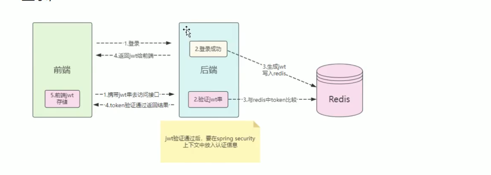

# 前后端分离项目的SpringSecurity基本配置

## 基本流程

1. **用户登录**  
   - 前端通过 `/login` 接口提交用户名和密码。
   - 后端通过自定义的 `UserServiceImpl` 实现 `UserDetailsService`，根据用户名查询数据库，返回用户信息和角色。
   - Spring Security 自动调用 `loadUserByUsername` 方法进行认证。

2. **认证与授权**  
   - 登录成功后，生成 JWT Token，前端保存并在后续请求中携带。
   - 后端通过自定义 `JwtFilter` 解析 Token，设置 `Authentication` 到 SecurityContext。
   - 通过注解如 `@PreAuthorize("hasRole('admin')")` 控制接口访问权限。

3. **登出与异常处理**  
   - `/logout` 接口处理登出，清理 Token。
   - 自定义 Handler 处理未认证、权限不足、登录失败等异常，返回统一 JSON 响应。

## 流程图



## 主要配置内容

- **SecurityConfig**  
  - 关闭 Session，采用无状态（`SessionCreationPolicy.STATELESS`）。
  - 配置自定义登录、登出、异常处理 Handler。
  - 添加 JWT 过滤器到 Spring Security 过滤链。
  - 关闭 CSRF，支持跨域。
  - 所有接口默认需要认证，可通过注解细粒度控制。

- **自定义过滤器与处理器**  
  - `JwtFilter`：解析 JWT，设置认证信息。
  - `CaptchaFilter`：验证码校验（如有）。
  - `MyLoginSuccessHandler`、`MyLoginFailureHandler`、`MyLogOutSuccessHandler`、`MyAccessDeniedHandler`、`MyAuthenticationEntryPoint`：分别处理登录成功、失败、登出、无权限、未认证等情况。

## UserDetailsService 接口介绍

`UserDetailsService` 是 Spring Security 用于加载用户信息的核心接口，定义如下：

```java
public interface UserDetailsService {
    UserDetails loadUserByUsername(String username) throws UsernameNotFoundException;
}
```
- 实现该接口，重写 `loadUserByUsername` 方法，根据用户名查询数据库，返回实现了 `UserDetails` 的用户对象（如 `TUser`）。
- Spring Security 会自动调用该方法进行用户认证。

> **注:** 也可以实现`UserDetailsManager`, 该接口还提供了创建用户相关方法

## Authentication 接口介绍

`Authentication` 代表当前认证主体（用户）的认证信息，常见实现有 `UsernamePasswordAuthenticationToken`。
- 认证成功后，`Authentication` 会被存储在 `SecurityContextHolder` 中，后续可通过 `SecurityContextHolder.getContext().getAuthentication()` 获取当前用户信息。
- 你可以在 Controller 方法参数中直接注入 `Authentication`，获取当前登录用户。

> **注:** 如果Authentication对象已经存在(意味着已经通过认证), SpringSecurity 不会在调用 `loadUserByUsername` 方法查询用户信息.