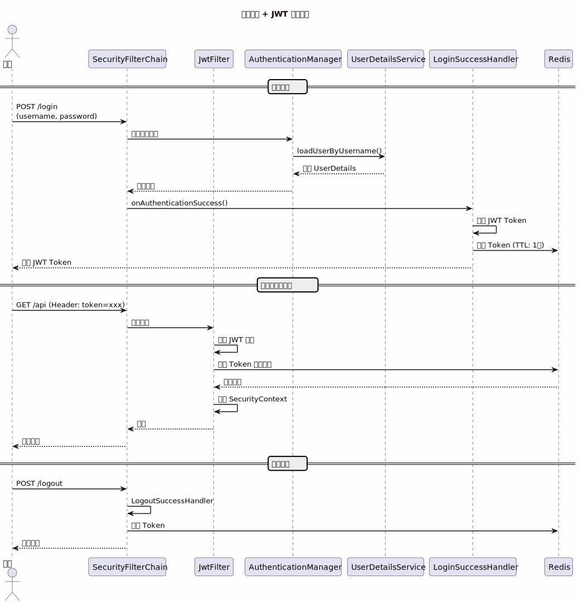
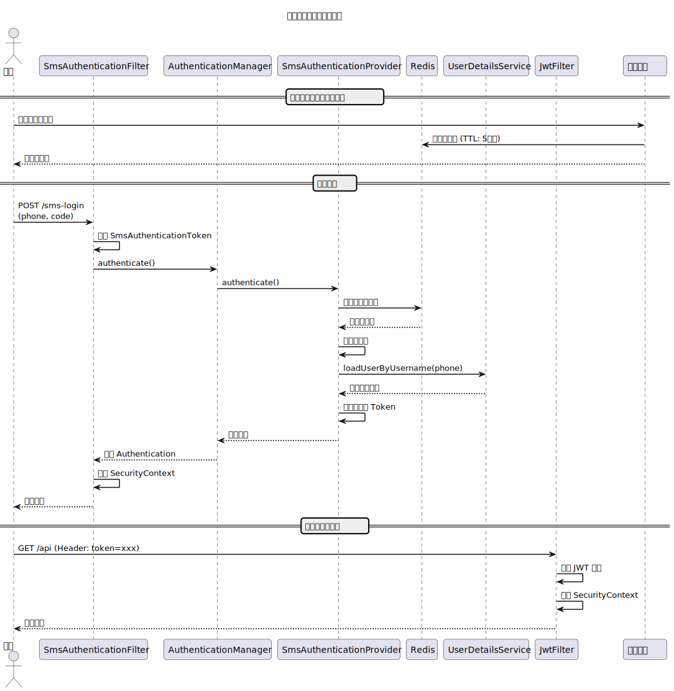
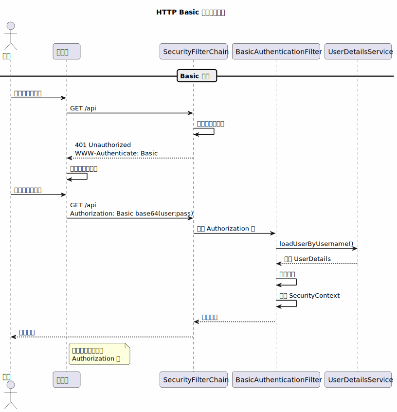
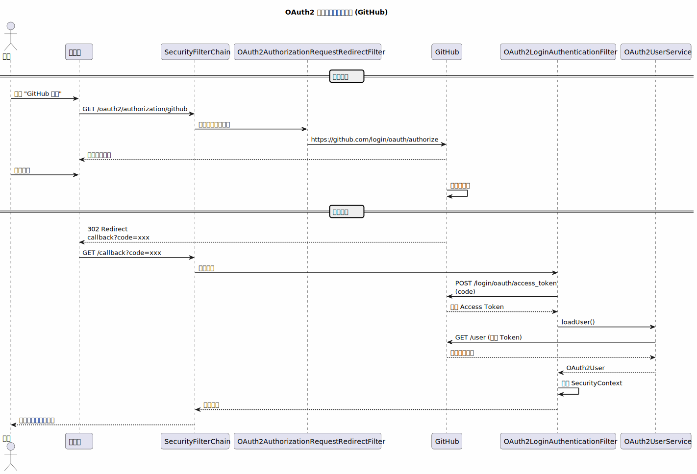

# SpringSecurity

## 工作流程

### 认证和授权


## 集成到 Spring Boot

### 依赖引入

```xml
<!-- Spring Security 核心，引入后自动配置 SecurityFilterChain -->
<dependency>
    <groupId>org.springframework.boot</groupId>
    <artifactId>spring-boot-starter-security</artifactId>
</dependency>

<!-- Web 支持 -->
<dependency>
    <groupId>org.springframework.boot</groupId>
    <artifactId>spring-boot-starter-web</artifactId>
</dependency>

<!-- MyBatis，用于用户/角色数据查询 -->
<dependency>
    <groupId>org.mybatis.spring.boot</groupId>
    <artifactId>mybatis-spring-boot-starter</artifactId>
    <version>3.0.4</version>
</dependency>

<!-- Redis，用于 Token 存储 -->
<dependency>
    <groupId>org.springframework.boot</groupId>
    <artifactId>spring-boot-starter-data-redis</artifactId>
</dependency>

<!-- Hutool，用于 JWT 签发/验证 -->
<dependency>
    <groupId>cn.hutool</groupId>
    <artifactId>hutool-all</artifactId>
    <version>5.8.39</version>
</dependency>

<!-- Lombok，简化实体类代码 -->
<dependency>
    <groupId>org.projectlombok</groupId>
    <artifactId>lombok</artifactId>
</dependency>

<!-- 数据库驱动 -->
<dependency>
    <groupId>org.mariadb.jdbc</groupId>
    <artifactId>mariadb-java-client</artifactId>
</dependency>
```

> `spring-boot-starter-security` 是核心依赖，引入后 Spring Boot 会自动配置 `SecurityFilterChain`。
> 其余依赖根据实际需求选配。

---

### 通用配置

#### 密码加密

见 [`SecurityBaseConfig.java:20-22`](common/src/main/java/com/demo/config/SecurityBaseConfig.java#L20-L22)

Spring Security 在存储和校验密码时需要 `PasswordEncoder`，负责注册时加密存储、登录时比对明文与密文。

- 注册时需手动调用 `passwordEncoder.encode(rawPassword)` 加密后再进行存储
- 登录时 Spring Security 自动调用 `passwordEncoder.matches()` 比对，无需手动处理

| 算法 | 特点 | 适用场景 |
|------|------|----------|
| BCrypt | 含随机 salt，每次密文不同，计算可调 | Spring Security 推荐，通用场景 |
| SHA-256 | 固定 salt 可被彩虹表攻击，需额外加盐 | 不推荐单独使用 |
| PBKDF2 | 标准 NIST 推荐，可调迭代次数 | 政府/合规场景 |
| Argon2 | 2015 年密码哈希竞赛冠军，抗 GPU 破解 | 高安全要求场景 |

---

#### 跨域与 CSRF

见 [`SecurityBaseConfig.java:24-44`](common/src/main/java/com/demo/config/SecurityBaseConfig.java#L24-L44)

> **注意：** `setAllowedOrigins(List.of("*"))` 与 `setAllowCredentials(true)` 不能同时使用。若需携带凭证，应指定具体域名列表。

---

#### 异常处理

- 未认证：[`MyAuthenticationEntryPoint.java`](common/src/main/java/com/demo/handler/MyAuthenticationEntryPoint.java)
- 权限不足：[`MyAccessDeniedHandler.java`](common/src/main/java/com/demo/handler/MyAccessDeniedHandler.java)

---

#### 注解式授权

- 启用：`@EnableMethodSecurity` 见 [`SecurityBaseConfig.java:16`](common/src/main/java/com/demo/config/SecurityBaseConfig.java#L16)
- 示例：[`HelloController.java`](form-auth/src/main/java/com/demo/controller/HelloController.java)

---

### 认证方式

#### 表单认证

基于用户名密码登录，服务端签发 JWT Token，后续请求携带 Token 完成无状态认证。



**`SecurityFilterChain` 配置：**

开启表单登录，配置登录/登出地址及处理器，将 JWT 过滤器添加到过滤链中。

- [`SecurityConfig.java`](form-auth/src/main/java/com/demo/config/SecurityConfig.java)

**登录成功 — 签发 JWT 并存入 Redis：**

认证成功后由 `AuthenticationSuccessHandler` 签发 JWT Token，存入 Redis 以支持 Token 失效管理。

- [`MyLoginSuccessHandler.java`](common/src/main/java/com/demo/handler/MyLoginSuccessHandler.java)

**登录失败处理：**

- [`MyLoginFailureHandler.java`](common/src/main/java/com/demo/handler/MyLoginFailureHandler.java)

**JWT 过滤器 — 每次请求校验 Token：**

自定义 `OncePerRequestFilter`，从请求头提取 Token 并验证签名，校验通过后将用户信息设置到 `SecurityContext`。

- [`JwtFilter.java`](form-auth/src/main/java/com/demo/filter/JwtFilter.java)

**登出 — 删除 Redis 中的 Token：**

- [`MyLogOutSuccessHandler.java`](common/src/main/java/com/demo/handler/MyLogOutSuccessHandler.java)

---

#### 短信验证码登录

通过手机号 + 短信验证码完成认证，无需密码。需要自定义 `AuthenticationProvider` 和 `AuthenticationFilter` 三个核心组件。



**自定义 `AuthenticationToken`：**

封装手机号作为认证主体，区分已认证和未认证两种状态。短信登录无密码凭证，`getCredentials()` 返回验证码。

**自定义 `AuthenticationProvider`：**

从 Redis 获取缓存的验证码进行比对，校验通过后通过手机号加载用户信息，返回已认证的 Token。

**自定义 `AuthenticationFilter`：**

拦截 `/sms-login` POST 请求，从参数中提取手机号和验证码，构建未认证 Token 并委托 `AuthenticationManager` 认证。

**`SecurityFilterChain` 配置：**

注册自定义 Provider 和 Filter 到 SecurityFilterChain 中。

- [`SecurityConfig.java`](sms-login/src/main/java/com/demo/config/SecurityConfig.java)
- [`JwtFilter.java`](sms-login/src/main/java/com/demo/filter/JwtFilter.java)

---

#### Basic 认证

通过请求头 `Authorization: Basic base64(username:password)` 传输凭证，适合内部服务或调试场景。



**工作原理：**

1. 浏览器访问受保护资源，服务端返回 `401` 及 `WWW-Authenticate: Basic` 响应头
2. 浏览器弹出登录对话框，用户输入用户名密码
3. 浏览器将 `username:password` 进行 Base64 编码后放入 `Authorization` 请求头
4. 每次请求都会携带该头，服务端解码并校验

**`SecurityFilterChain` 配置：**

使用 `httpBasic(Customizer.withDefaults())` 启用 HTTP Basic 认证，配合 `UserDetailsService` 完成凭证校验。

- [`SecurityConfig.java`](basic-auth/src/main/java/com/demo/config/SecurityConfig.java)

**客户端请求示例：**

```bash
# 使用 -u 参数，curl 会自动进行 Base64 编码
curl -u admin:123456 http://localhost:8080/hello

# 或手动设置 Authorization 请求头
curl -H "Authorization: Basic YWRtaW46MTIzNDU2" http://localhost:8080/hello
```

> HTTP Basic 明文传输凭证，生产环境务必配合 HTTPS 使用。

---

#### OAuth2 第三方登录

通过 OAuth2 协议接入第三方身份提供商（如 GitHub、Google），实现免注册登录。



**依赖引入：**

```xml
<!-- OAuth2 客户端支持 -->
<dependency>
    <groupId>org.springframework.boot</groupId>
    <artifactId>spring-boot-starter-oauth2-client</artifactId>
</dependency>
```

**`application.yml` 配置（以 GitHub 为例）：**

```yaml
spring:
    security:
        oauth2:
            client:
                registration:
                    github:
                        client-id: your-client-id
                        client-secret: your-client-secret
                        scope: read:user,user:email
```

**工作流程：**

1. 用户点击"GitHub 登录"，重定向到 GitHub 授权页面
2. 用户确认授权后，GitHub 回调应用并携带授权码
3. 应用用授权码换取 Access Token
4. 用 Access Token 调用 GitHub API 获取用户信息
5. 将用户信息设置到 `SecurityContext`，完成登录

**`SecurityFilterChain` 配置：**

- [`SecurityConfig.java`](oauth2-login/src/main/java/com/demo/config/SecurityConfig.java)

**自定义 OAuth2 用户映射：**

通过 `DefaultOAuth2UserService` 扩展，将第三方用户信息映射到本地用户体系。

- [`HelloController.java`](oauth2-login/src/main/java/com/demo/controller/HelloController.java)

> 第三方登录需要先在对应平台（GitHub、Google 等）注册 OAuth Application，获取 `client-id` 和 `client-secret`。