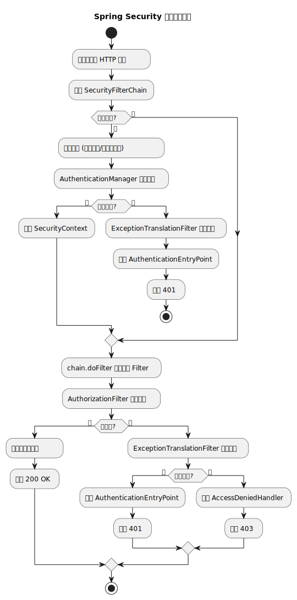

# SpringSecurity

## 工作流程

### 认证和授权



## 集成到 Spring Boot

### 依赖引入

```xml
<!-- Spring Security 核心，引入后自动配置 SecurityFilterChain -->
<dependency>
    <groupId>org.springframework.boot</groupId>
    <artifactId>spring-boot-starter-security</artifactId>
</dependency>

<!-- Web 支持 -->
<dependency>
    <groupId>org.springframework.boot</groupId>
    <artifactId>spring-boot-starter-web</artifactId>
</dependency>

<!-- MyBatis，用于用户/角色数据查询 -->
<dependency>
    <groupId>org.mybatis.spring.boot</groupId>
    <artifactId>mybatis-spring-boot-starter</artifactId>
    <version>3.0.4</version>
</dependency>

<!-- Redis，用于 Token 存储 -->
<dependency>
    <groupId>org.springframework.boot</groupId>
    <artifactId>spring-boot-starter-data-redis</artifactId>
</dependency>

<!-- Hutool，用于 JWT 签发/验证 -->
<dependency>
    <groupId>cn.hutool</groupId>
    <artifactId>hutool-all</artifactId>
    <version>5.8.39</version>
</dependency>

<!-- Lombok，简化实体类代码 -->
<dependency>
    <groupId>org.projectlombok</groupId>
    <artifactId>lombok</artifactId>
</dependency>

<!-- 数据库驱动 -->
<dependency>
    <groupId>org.mariadb.jdbc</groupId>
    <artifactId>mariadb-java-client</artifactId>
</dependency>
```

> `spring-boot-starter-security` 是核心依赖，引入后 Spring Boot 会自动配置 `SecurityFilterChain`。
> 其余依赖根据实际需求选配。

---

### 通用配置

#### 密码加密

见 [`SecurityBaseConfig.java:20-22`](common/src/main/java/com/demo/config/SecurityBaseConfig.java#L20-L22)

Spring Security 在存储和校验密码时需要 `PasswordEncoder`，负责注册时加密存储、登录时比对明文与密文。

- 注册时需手动调用 `passwordEncoder.encode(rawPassword)` 加密后再进行存储
- 登录时 Spring Security 自动调用 `passwordEncoder.matches()` 比对，无需手动处理

| 算法 | 特点 | 适用场景 |
|------|------|----------|
| BCrypt | 含随机 salt，每次密文不同，计算可调 | Spring Security 推荐，通用场景 |
| SHA-256 | 固定 salt 可被彩虹表攻击，需额外加盐 | 不推荐单独使用 |
| PBKDF2 | 标准 NIST 推荐，可调迭代次数 | 政府/合规场景 |
| Argon2 | 2015 年密码哈希竞赛冠军，抗 GPU 破解 | 高安全要求场景 |

---

#### 跨域与 CSRF

见 [`SecurityBaseConfig.java:24-44`](common/src/main/java/com/demo/config/SecurityBaseConfig.java#L24-L44)

> **注意：** `setAllowedOrigins(List.of("*"))` 与 `setAllowCredentials(true)` 不能同时使用。若需携带凭证，应指定具体域名列表。

---

#### 异常处理

- 未认证：[`MyAuthenticationEntryPoint.java`](common/src/main/java/com/demo/handler/MyAuthenticationEntryPoint.java)
- 权限不足：[`MyAccessDeniedHandler.java`](common/src/main/java/com/demo/handler/MyAccessDeniedHandler.java)

---

#### 注解式授权

- 启用：`@EnableMethodSecurity` 见 [`SecurityBaseConfig.java:16`](common/src/main/java/com/demo/config/SecurityBaseConfig.java#L16)
- 示例：[`HelloController.java`](form-auth/src/main/java/com/demo/controller/HelloController.java)

---

### 认证方式

本项目提供4种常用的认证方式实现。点击下表中的链接查看各认证方式的详细文档。

| 认证方式 | 描述 | 适用场景 | 复杂度 |
|---------|------|---------|-------|
| [表单认证](form-auth/README.md) | 用户名/密码 + JWT Token | Web 应用常见方式 | 中 |
| [短信认证](sms-auth/README.md) | 手机号 + 短信验证码 | 移动应用、无密码登录 | 高 |
| [Basic认证](basic-auth/README.md) | HTTP Authorization 请求头 | 内部服务、API调试 | 低 |
| [OAuth2登录](oauth2-auth/README.md) | 第三方身份提供商登录 | 免注册第三方登录 | 高 |

---

#### 表单认证

基于用户名密码登录，服务端签发 JWT Token，后续请求携带 Token 完成无状态认证。


详见 [表单认证完整文档](form-auth/README.md)

---

#### 短信验证码登录

通过手机号 + 短信验证码完成认证，无需密码。自定义 `AuthenticationProvider` 和 `AuthenticationFilter` 实现。


详见 [短信认证完整文档](sms-auth/README.md)

---

#### Basic 认证

通过请求头 `Authorization: Basic base64(username:password)` 传输凭证，适合内部服务或调试场景。


详见 [Basic认证完整文档](basic-auth/README.md)

---

#### OAuth2 认证

通过 OAuth2 协议接入第三方身份提供商（如 GitHub、Google），实现免注册登录。


详见 [OAuth2认证完整文档](oauth2-auth/README.md)
