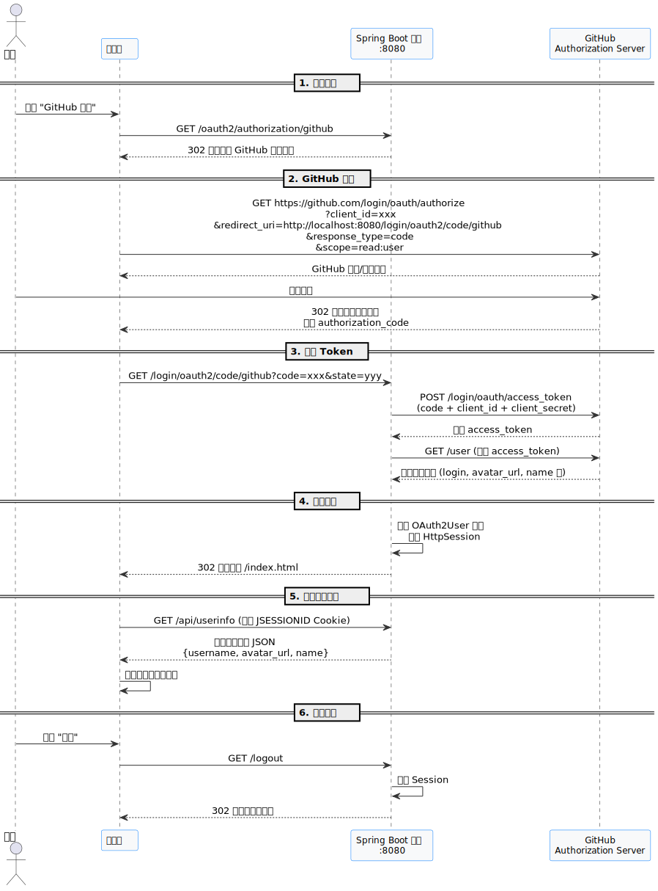

# OAuth2 GitHub 登录 Demo

基于 Spring Security OAuth2 Client 实现的 GitHub 第三方登录示例项目。

## 认证流程

当前demo整个认证流程如下:



### 流程详解

1. **发起登录**: 用户点击前端页面的 "GitHub 登录" 按钮，浏览器请求 `/oauth2/authorization/github`，Spring Security 自动重定向到 GitHub 授权页面

2. **GitHub 授权**: 用户在 GitHub 页面确认授权，GitHub 生成授权码 (authorization_code) 并重定向回应用的回调地址

3. **换取 Token**: Spring Security 拦截回调请求，使用授权码向 GitHub 换取 access_token，再用 token 获取用户信息

4. **建立会话**: 应用将用户信息封装为 `OAuth2User` 对象存入 HttpSession，后续请求通过 Cookie 中的 JSESSIONID 识别用户

5. **获取用户信息**: 前端调用 `/api/userinfo` 接口获取当前登录用户信息并展示

6. **退出登录**: 调用 `/logout` 清除 Session

## 项目结构

```
oauth2-auth/
├── src/main/java/com/demo/
│   ├── Oauth2AuthApplication.java      # 启动类
│   ├── config/
│   │   └── SecurityConfig.java         # Spring Security 配置
│   └── controller/
│       └── UserInfoController.java     # 用户信息接口
├── src/main/resources/
│   ├── application.yml                 # 应用配置
│   └── static/
│       ├── index.html                  # 登录演示页面
│       ├── main.js                     # 前端交互逻辑
│       └── style.css                   # 样式文件
└── pom.xml
```

## 接口说明

### 公开接口

| 路径 | 方法 | 说明 |
|------|------|------|
| `/` | GET | 登录演示页面（重定向至 index.html） |
| `/index.html` | GET | 登录演示页面 |
| `/login` | GET | OAuth2 登录入口 |
| `/oauth2/authorization/github` | GET | 发起 GitHub 授权 |
| `/style.css` | GET | 样式文件 |
| `/main.js` | GET | 前端交互脚本 |
| `/login/oauth2/code/github` | GET | GitHub 回调地址 |

### 受保护接口

| 路径 | 方法 | 说明 | 所需权限 |
|------|------|------|----------|
| `/api/userinfo` | GET | 获取当前登录用户信息 | 已认证 |


## OAuth2Login 配置详解

Spring Security 的 `oauth2Login()` 方法提供了丰富的配置选项，用于自定义 OAuth2 登录流程。以下是完整的配置方法树：

### 配置方法树

```
oauth2Login()
├── loginPage()                        自定义登录页面
├── loginProcessingUrl()               登录请求处理路径  
├── defaultSuccessUrl()                登录成功跳转地址
├── failureUrl()                       登录失败跳转地址
├── authorizationEndpoint()            授权端点配置
│   ├── authorizationRequestResolver() 自定义授权请求
│   └── authorizationRequestRepository() 授权请求存储
├── tokenEndpoint()                    Token 端点配置
│   └── accessTokenResponseClient()    自定义 Token 交换逻辑
├── userInfoEndpoint()                 用户信息端点配置
│   ├── userAuthoritiesMapper()        权限映射
│   ├── userService()                  自定义用户加载（OAuth2）
│   └── oidcUserService()              自定义用户加载（OIDC）
├── redirectUri()                      重定向 URI 配置
├── clientRegistrationRepository()     客户端注册信息存储
├── authorizedClientRepository()       已授权客户端存储
├── authorizedClientService()          已授权客户端服务
├── successHandler()                   登录成功处理器
└── failureHandler()                   登录失败处理器
```

### 配置方法说明

| 配置方法 | 作用 | 默认值 | 常见应用场景 |
|---------|------|--------|------------|
| `loginPage()` | 自定义登录页面 URL | `/login` | 使用自定义登录页面 |
| `loginProcessingUrl()` | 处理登录请求的 URL | `/login/oauth2/code/*` | 自定义回调路径 |
| `defaultSuccessUrl()` | 登录成功后跳转地址 | `/` | 登录后重定向到指定页面 |
| `failureUrl()` | 登录失败后跳转地址 | `/login?error` | 登录失败重定向处理 |
| `authorizationEndpoint()` | 配置授权端点 | 内置配置 | 自定义授权请求流程 |
| `tokenEndpoint()` | 配置 Token 端点 | 内置配置 | 自定义 Token 交换逻辑 |
| `userInfoEndpoint()` | 配置用户信息端点 | 内置配置 | 权限映射、自定义用户加载 |
| `redirectUri()` | 重定向 URI 配置 | 自动生成 | 多套环境配置 |
| `successHandler()` | 登录成功处理器 | `SavedRequestAwareAuthenticationSuccessHandler` | 自定义登录成功逻辑 |
| `failureHandler()` | 登录失败处理器 | `SimpleUrlAuthenticationFailureHandler` | 自定义登录失败逻辑 |

### 本 Demo 的配置

本 Demo 使用以下 `oauth2Login()` 配置：

```java
.oauth2Login(oauth2 -> {
    oauth2.defaultSuccessUrl("/index.html", true)  // 登录成功后跳转到首页
          .permitAll()                             // 允许所有用户访问 OAuth2 登录
})
```

详见 [`SecurityConfig.java`](src/main/java/com/demo/config/SecurityConfig.java)


## 快速开始

### 1. 创建 GitHub OAuth App

1. 访问 [GitHub Developer Settings](https://github.com/settings/developers)
2. 点击 **OAuth Apps** → **New OAuth App**
3. 填写以下信息：
   - **Application name**: 任意名称（如 `springboot-oauth2-demo`）
   - **Homepage URL**: `http://localhost:8080`
   - **Authorization callback URL**: `http://localhost:8080/login/oauth2/code/github`

4. 创建后获取 **Client ID** 和 **Client Secret**

### 2. 配置Application.yml

编辑 `src/main/resources/application.yml`，替换为你的 GitHub OAuth App 凭据。

**内置 Provider**只需配置 `client-id` 和 `client-secret`：

```yaml
spring:
  security:
    oauth2:
      client:
        registration:
          github:
            client-id: YOUR_CLIENT_ID
            client-secret: YOUR_CLIENT_SECRET
```

> [!TIP]
>
> Spring Security 通过 `CommonOAuth2Provider` 内置支持以下 Provider：**Google**、**GitHub**、**Facebook**、**X**（Twitter）、**Okta**。

**非内置 Provider**（如钉钉、企业微信）需要配置以下字段：

| 字段 | 说明 |
|------|------|
| `client-id` | 应用标识 |
| `client-secret` | 应用密钥 |
| `provider` | 提供商 ID（用于关联 provider 配置） |
| `authorization-uri` | 授权端点 URL |
| `token-uri` | 令牌端点 URL |
| `user-info-uri` | 用户信息端点 URL |
| `user-name-attribute` | 用户名属性名（响应中用于提取用户名的字段） |

```yaml
spring:
  security:
    oauth2:
      client:
        registration:
          dingtalk:
            client-id: YOUR_CLIENT_ID
            client-secret: YOUR_CLIENT_SECRET
            # 注意：存一个与当前resitration同名的provider时， 这里的provider 字段可省略；不同名时需显式指定 provider
            provider: dingtalk
        provider:
          dingtalk:
            authorization-uri: https://api.dingtalk.com/connect/oauth2/authorize
            token-uri: https://api.dingtalk.com/oauth2/token
            user-info-uri: https://api.dingtalk.com/topapi/v2/user/get
            user-name-attribute: nick
```

### 3. 配置SecurityFilterChain

配置详见 [`SecurityConfig.java`](src/main/java/com/demo/config/SecurityConfig.java)

### 4. 启动项目

```bash
# 编译并启动
mvn spring-boot:run

# 或使用 IDE 直接运行 Oauth2AuthApplication.main()
```

应用启动后访问: http://localhost:8080/index.html

